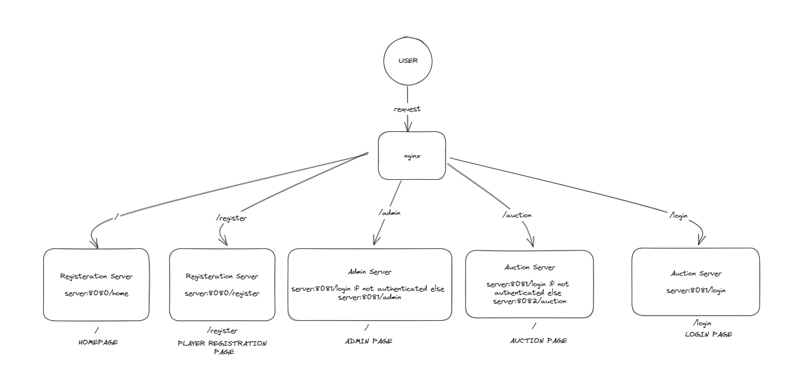

# Auction Website

### Introduction
This web application can be used to get user registered for auctions, assign base prices and other parameters to them for auctions and then conduction and mantaing sales to teams.
This application has 3 seperate services - 
1. `Registration` - This service is used to get the players registered for auctions
2. `Admin` - This service will be used by the admin to add members who conduct auctions and assign parameters and base prices to the players who registered for the event.
3. `Auction` - This service will be used to conduct auction

### Architecture
This application is designed in a way that registration and homepage are on a single server, admin on another server and auctions on yet another server. Since we only have one server we will be using different ports of the same server to run these services

So Let's say Registration Server will run on port 8080, Admin Server will run on port 8081 and Auction Server will run on port 8082.
We will be runnig nginx on port 81 which will route requests to the servers automatically.

Here is a simple image to explain the architecture for this application- 

### Deployment
#### Prerequisites
1. You should have docker installed
2. You should have nginx installed
Run commands \
`sudo service docker start` \
`sudo service nginx start`

#### Steps
1. Git Clone the Repository \
`git clone https://github.com/GuptaPurujit/Auction-Website.git` \
`cd Auction-Website`

2. Build Docker Images\
`docker build --tag registration-server --build-arg server_name=registration-server .` \
`docker build --tag admin-server --build-arg server_name=admin-server .` \
`docker build --tag auction-server --build-arg server_name=auction-server .`

3. Run Docker Containers \
`docker run -d -p 8080:8080 registration-server` \
`docker run -d -p 8081:8080 admin-server` \
`docker run -d -p 8082:8080 auction-server`

4. Place the contents of [auction_server.conf](installables/auction-server.conf) present in installabes folder into __/etc/nginx/sites-enabled/__ using `vi auction-server` command